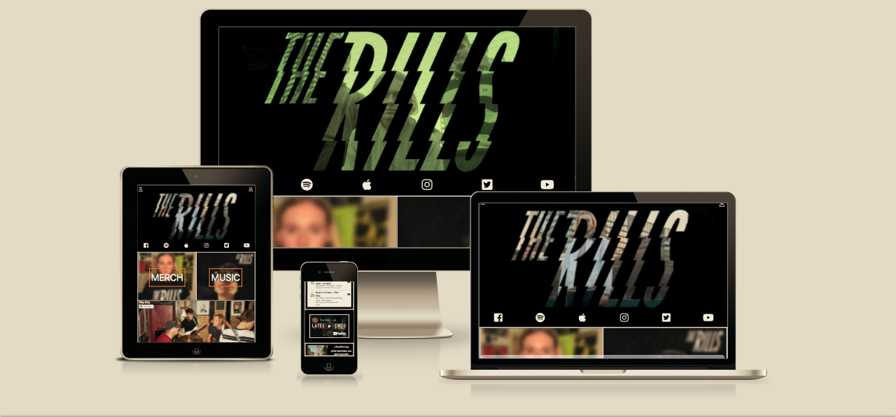
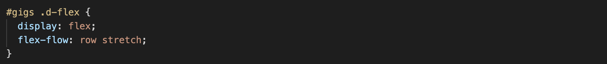

# The Rills 

I've decied to build The Rills a site to help with their promotion, gigs and merchandise. Prior to coding, I worked in the music industry and feel my knowledge can be applied positively for this project. 

# UX 

This website is for an Indie band called **The Rills**. The Rills are a relatively new band so we can assume the majority of their fans will be of Scoial Media age. 
As a musician and tech user, I've noticed how the large majority of music based websites feel very outdated and linear. Which is perculiar considering the target user. 

Nonetheless, my conceptual idea to help resolve this issue hinges on the _nature_ in which social media is consumed. Instead of a traditional landing page, I felt one that invites navigation would be far more intuiative and natural. The ease in which technology can be consumed determines the level of user engagement. A mix of Dashboard and Hub and Spoke structure should compliment this design.

###### ***Wireframe model aligned with this concept*** 

This intuative layout not only keeps the user engaged, it prompts the user to move down through the homepage. This will help highlight key areas that the band want to focus on. For The Rills, it will help promote their new gigs and merchandise more effectively. Each section can be simple and bold with little information encouraging the user to interact and naviate through the content.

Technology needs to reflect the product. With music being the subject for this product, some components of the site need be dynamic and lively. 

I've highlighted **four** generally static features that need changing:

1. Replace the tab section, usually top right of the landing page, with a burger icon. A menu page that opens and collapses from the left side. Indicated by three hased lines. This will also help to keep the site focused.
2. Instead of a singular hero image to greet the user, make a simple image carousel showing off live gigs, press shots and other important aspects of the band.
3. Replace the standard scroll bar with one that appears when the user is scrolling.
4. Make a thin socials nav bar below the carousel to help convert users into followers.

With this style implemented, adding boxed sections is far easier. These sections can be floating and don't need to be tabbed. Keeping the site current with a more newsfeed type feel.

# Features

- Social media strip bar at the top rather than stuck at the bottom. This encourages and makes it easier for the user to follow the band. In this age, social media is essential in the music industry and as a product helps drive other sales.

- A collapsable section menu. Using a burger icon to hide navbar tabs allows the user to digest everything on the landing page. It keeps them focused on the important content and puts more ernest on the social media design.

- Black and white monochromatic color style to match the band logo and overall aesthtic. Helps the user to feel secure and in the right place. Image is extremely important for artists so the colour design needs to make sense. I want the site to become another powerful tool to help grow their community.

- Direct subscribe button on the youtube section. A similar feature to the social media navbar but will help to keep user on the page and not directed away. More time spent on the site means more merch and gig sales should occur.

- Standard email sign up form to help gather valuable data. Gives the user an opportuinty to signup for exclusive content, merch and song releases.

- Live gigs sction where user can directly buy tickets. This will be immediately under the socials bar purely to reflect UX. The most important features are placed higher in the pecking order.

### Features left to implement 

- Unable to implement at this stage of my learning but eventually id like to make a hub section. With this feature we could make a community area for people to share stories, photos, videos and generally chat amongst The Rills community. Will help keep users engaged, wanting to come check out the site and feel connected with the band.
- Create an e-shop section so the user can purchase merchandise and releases from the site. Will help with collecting data and API whilst keeping the user on the hub.

# Technology Used

- [HTML](https://html.com/)
    - The project uses HTML to build the wesbite structure and content.
- [CSS](https://www.w3.org/Style/CSS/Overview.en.html)
    - CSS is deployed to style and personalise the structured content made with HTML.
- [Bootstrap](https://getbootstrap.com/)
    - Bootstrap is used to create the building blocks for a user friendly, mobile-first design. It incorporates JavaScript, CSS and HTML functions.

# Testing

## Buttons

- Sidepanel Collapsable:
> i. Tested button on computer, mobile and tablet. Sidepanel opens to reveal nav links correctly

> ii. Tested the close button on computer, mobile and tablet. Button closes the Sidepanel without issue.

> iii. Tested all the nav links on computer, mobile and tablet. They all navigate to their corrosponding sections and hover color change works for each link.

- Account Nav Button:
> i. Tested button on computer, mobile and tablet. The account icon opens up the modal sign up form everytime. 

> ii. Submit button produces no message because I have dont have the appropriate database knowledge yet to store account information but inputs are required.

> iii. Close button has been tested on computer, mobile and tablet. Each time it produces the correc response and closes the modal.

- Social Bar Icons:
> i. Tested all social icon buttons on computer, mobile and tablet. Each icon takes you to the correct address which will be the The Rills page for each domain. ie. 
The Facebook icon will take you to their homepage.

- Shopping Panels:
> i. Probably the most important section in terms of the artist brief. Styled the buttons to be big and bold, attracting the user. 
The Merch button takes you directly to The Rills bandcamp page which is the only place you can purcahse their Classic T Shirt. The button works on computer, mobile and tablet.

> ii. The Music button, equally as important takes you to The Rills apple music page as I feel their fanbase is more likely to use this application.
Again, the button has been tested and works correctly on computer, mobile and tablet. Each reponse produces the deired response.

- Events/Gigs section:
> i. Clicked The Rills link and it took me back to the homepage. Fixed this error in the code as the link destination was incorrect.
The link now takes you to the desired location, thier Facebook page.

> ii. The homemade **Like Page** button was also intended to take you straight to The Rills Facebook page but again the link was broken.
Seems there was no link destination in the HTML file at all. I have now rectified this and both butttons work on mobile, computer and tablet.

>iii. The name of each event is associated with the corrosponding event on Facebook to help with reach and ticket sales. All links are working and
produce the desired response.

>iiii. The ticket buttons are supposed to help with User Experience and symbolism. These links instead of taking you to the Facebook event, take you to the
direct ticket site. Making it easier and reducing the steps it would take to purchase a ticket. All links work on mobile, computer and tablet.

About/ Sign Up section:

>i. I produced two ways to sign up on the site because as I stated in my future features area, I feel like creating an account for the Hub section could be really powerful for The Rills.
I intend to utilise the sign up sections and build a reddit esque area for the site. The button works and produces the same modal as the account icon at the top.

## Viewport Response

## Issues

- Mobile:
 i. The Rills link and Facebook button keep moving outside of the parent div. Adjusted the bottom and right percentage to help it scale properly for each viewport.

 ii. The ticket buttons on bigger screens were too central. I created a media query to increase the VW associated with the ticket button for medium size screens and over.
 Equally, on mobile screen the ticket button was too close to the edge so I done the opposite and reduced the VW of the ticket button. Now its placed correctly on all screens.

- Laptop: 
 i. I kept running into issues with the caraousel indicators with the bigger screen sizes. The indicators kept rendering too low and made the layout look clunky.
 In the end I removed the indicators altogeher because I felt it gave the header some breathing space and made the logo stand out.

 ii. The social bar icons were also too small on laptop and larger screens so again I introduced a media query which would increase the font size of the icon on screens large and up.

Tested the Facebook button once it had been styled and placed correctly in terms of layout but the link was broken. Addressed the issue in later stage when finalising all the button tests.

## Bugs

i. Ran into one continuouse bug throughout the building process

## Styling

- Just tested the sign up form button. The modal displays correctly and fits the screen. However, the "Accept Terms" text is in blue, need to make orange like the highlights throughout the site.

## Code Validation

[HTML Validator](https://validator.w3.org/nu/?doc=https%3A%2F%2Fsleepyman93.github.io%2FUser-Centric-Frontend-Milestone-Project%2F "HTML Validation link)
[CSS Validatior](https://jigsaw.w3.org/css-validator/validator?uri=https%3A%2F%2Fsleepyman93.github.io%2FUser-Centric-Frontend-Milestone-Project%2F&profile=css3svg&usermedium=all&warning=1&vextwarning=&lang=en#warnings "CSS Validation Link)

## Navbar
- Used navbar-custom to manipulate the background colour. Same principle was applied to the toggler-icon, using the custom class allowed me to change the colour and size to fit the site.
- Removed bootstraps navbar-toggler with a font awesome image. Allowed me to float the icon and toggle left side of the navbar. I used display:block on the navbar to use all the width available.
- The nav-link inherits a defined color from Bootstrap. This color can't be overwritten with standard CSS so i used the !important class to force the color override to white.

## carousel
- Removing my carousel CSS actually corrected my scaling issue. Now when display port is resized the images reduce maintaing their original aspect ratio. Fixing the width to 100 instead of img-fluid helps correct aspect width ratio.
- Removed indicators entirely from the carousel because it lookked clutered and didnt work with the overall aestehtic in the end.

# Deployment

When the site had been finalised. After all the files, media and css had been pushed to the master branch in Github, the deployment stage could start. 
I went to the Github repository and clicked on settings. From here I made my way to the 'Github Pages' section. From here, under 'Source', it states "Github Pages is currently disabled". By choosing master in the dropdown menu, as in master branch of this repository, another dropdown menu is offered. 
This options is asking where to source the Master files from. In this case I chose Root because this is telling Pages to source files from the Root where all the pushed files are stored. Finally by clicking 'Save' Github Pages is now ready to be published under the URL displayed in this section.

To run the code locally, in the Terminal you will need to type **python3 -m http.server** to open a local port. A popup tab will appear in the bottom corner stating 'A service is available at port 8000', click **Open Browser** to deploy the site locally.

#  Credits

## Media

The photos used in this site were all obtained from The Rills Facebook page:

> - [The Rills Facebook](https://www.facebook.com/TheRills/photos)

## Acknowledgements

To avoid any issues of plagiarism, here are the sites used to help create building blocks for this site:

> 1. [w3School](https://www.w3schools.com)
> 2. [mdBootstrap](https://mdbootstrap.com)
> 3. [StackOverflow](http://stackoverflow.com)
> 4. [Bootstrap](https://getbootstrap.com)

# Resubmission

## Correcting links
   - Added target="_blank" to all the href links on the page. Deployed the site and tested every clickable link. Each link now 
   directs you to a new page, maintaining focus for the main site.

## Cleaning up README file
   - Ammended incorrect image file links. Wireframe now displays correctly.
   - Reformatted README file 

## Jigsaw Validation
   - Ammended CSS issues indicated by the Jigsaw Validator 
   - One issue claimed that "stretch" is not a "flex-flow" value and to correct to "row-stretch".
   After checking my code, "row-stretch" was already the value in place so not sure why the validator produced an error here.
   I've attached some screen shots to highlight this.

   
   

   - Through inspecting the website using chrome developer tools, I realised the "row-stretch" value creating the issue and the flex flow property
   are not even needed. Removed both to pass the validator. When checking in with my mentor, I addressed the 6 CSS issues that seemed valid. The two remaining
   I'm really not sure what the indicate. None of my code has these properties or values especially at line 6 as indicated. Hope this is enough of a correction to
   pass the learning objective.

   

